# Diagrama ER Simplificado - Base de Datos Zava

## Diagrama ER Básico

```mermaid
erDiagram
    %% ===== ENTIDADES PRINCIPALES =====
    
    Usuarios {
        int id_usuario PK
        varchar nombre
        varchar apellido
        varchar nickname UK
        varchar correo UK
        varchar telefono
        varchar contrasenia
        int id_rol FK
        varchar foto
        boolean activo
        timestamp fecha_registro
    }
    
    Roles {
        int id_rol PK
        varchar nombre UK
        text descripcion
    }
    
    Categorias {
        int id_categoria PK
        varchar nombre
        enum tipo
        boolean activo
    }
    
    %% ===== PRODUCTOS =====
    
    Productos {
        int id_producto PK
        int id_usuario FK
        varchar nombre
        text descripcion
        varchar marca
        int id_categoria FK
        decimal peso
        decimal precio
        int stock
        decimal descuento
        varchar imagen_principal
        boolean activo
        timestamp fecha_publicacion
    }
    
    Producto_Imagenes {
        int id_imagen PK
        int id_producto FK
        varchar ruta_imagen
        boolean es_principal
    }
    
    Favoritos_Productos {
        int id_favorito PK
        int id_producto FK
        int id_usuario FK
        timestamp fecha_agregado
    }
    
    %% ===== RECETAS =====
    
    Recetas {
        int id_receta PK
        int id_usuario FK
        varchar nombre
        text descripcion
        text ingredientes
        text pasos
        int tiempo_preparacion
        int porciones
        enum dificultad
        enum tipo_comida
        enum tipo_dieta
        int id_categoria FK
        varchar imagen_principal
        boolean activa
        timestamp fecha_publicacion
    }
    
    Receta_Imagenes {
        int id_imagen PK
        int id_receta FK
        varchar ruta_imagen
        boolean es_principal
    }
    
    Receta_Calificaciones {
        int id_calificacion PK
        int id_receta FK
        int id_usuario FK
        decimal calificacion
        text comentario
        timestamp fecha_calificacion
    }
    
    Favoritos_Recetas {
        int id_favorito PK
        int id_receta FK
        int id_usuario FK
        timestamp fecha_agregado
    }
    
    %% ===== RESTAURANTES =====
    
    Restaurantes {
        int id_restaurante PK
        int id_usuario FK
        varchar nombre
        text descripcion
        varchar direccion
        varchar telefono
        varchar tipo_comida
        text horarios
        decimal precio_promedio
        int id_categoria FK
        varchar imagen_principal
        boolean activo
        timestamp fecha_registro
    }
    
    Restaurante_Imagenes {
        int id_imagen PK
        int id_restaurante FK
        varchar ruta_imagen
        boolean es_principal
    }
    
    Restaurante_Calificaciones {
        int id_calificacion PK
        int id_restaurante FK
        int id_usuario FK
        decimal calificacion
        text comentario
        timestamp fecha_calificacion
    }
    
    Favoritos_Restaurantes {
        int id_favorito PK
        int id_restaurante FK
        int id_usuario FK
        timestamp fecha_agregado
    }
    
    %% ===== SISTEMA DE PEDIDOS =====
    
    Pedidos {
        int id_pedido PK
        int id_usuario FK
        varchar numero_pedido UK
        enum estado
        decimal subtotal
        decimal descuento
        decimal total
        int id_metodo_pago FK
        int id_datos_entrega FK
        enum tipo_entrega
        varchar nombre_retiro
        timestamp fecha_pedido
    }
    
    Detalle_Pedido {
        int id_detalle PK
        int id_pedido FK
        int id_producto FK
        int cantidad
        decimal precio_unitario
        decimal subtotal
    }
    
    Datos_Entrega {
        int id_dato PK
        int id_usuario FK
        varchar calle
        varchar numero
        varchar piso
        varchar ciudad
        text detalle_extra
    }
    
    Metodos_Pago {
        int id_metodo PK
        int id_usuario FK
        enum tipo_metodo
        varchar detalle
    }
    
    Usuarios_Baneados {
        int id_baneo PK
        int id_usuario FK
        text motivo
        timestamp fecha_baneo
    }
    
    %% ===== RELACIONES =====
    
    %% Relaciones principales
    Usuarios ||--o{ Roles : "tiene"
    Usuarios ||--o{ Usuarios_Baneados : "puede_ser_baneado"
    
    %% Productos
    Usuarios ||--o{ Productos : "publica"
    Categorias ||--o{ Productos : "categoriza"
    Productos ||--o{ Producto_Imagenes : "tiene"
    Usuarios ||--o{ Favoritos_Productos : "marca_favorito"
    Productos ||--o{ Favoritos_Productos : "es_favorito"
    
    %% Recetas
    Usuarios ||--o{ Recetas : "crea"
    Categorias ||--o{ Recetas : "categoriza"
    Recetas ||--o{ Receta_Imagenes : "tiene"
    Usuarios ||--o{ Receta_Calificaciones : "califica"
    Recetas ||--o{ Receta_Calificaciones : "recibe"
    Usuarios ||--o{ Favoritos_Recetas : "marca_favorito"
    Recetas ||--o{ Favoritos_Recetas : "es_favorito"
    
    %% Restaurantes
    Usuarios ||--o{ Restaurantes : "administra"
    Categorias ||--o{ Restaurantes : "categoriza"
    Restaurantes ||--o{ Restaurante_Imagenes : "tiene"
    Usuarios ||--o{ Restaurante_Calificaciones : "califica"
    Restaurantes ||--o{ Restaurante_Calificaciones : "recibe"
    Usuarios ||--o{ Favoritos_Restaurantes : "marca_favorito"
    Restaurantes ||--o{ Favoritos_Restaurantes : "es_favorito"
    
    %% Pedidos
    Usuarios ||--o{ Pedidos : "realiza"
    Metodos_Pago ||--o{ Pedidos : "paga_con"
    Datos_Entrega ||--o{ Pedidos : "entrega_en"
    Pedidos ||--o{ Detalle_Pedido : "contiene"
    Productos ||--o{ Detalle_Pedido : "es_pedido"
    
    %% Datos de usuario
    Usuarios ||--o{ Datos_Entrega : "tiene"
    Usuarios ||--o{ Metodos_Pago : "tiene"
```

## Características del Diseño Simplificado

### 🎯 **Simplificaciones Realizadas**

1. **Imágenes**: Una tabla por entidad pero más simple (solo ruta y si es principal)
2. **Ingredientes**: Vuelven a ser TEXT en la tabla Recetas
3. **Pasos**: TEXT simple en lugar de tabla separada
4. **Categorías**: Una sola tabla para todos los tipos
5. **Estados**: ENUM en lugar de tabla separada
6. **Etiquetas**: Eliminadas para simplificar

### 📊 **Estructura Básica**

- **17 tablas** principales (vs 45+ en la versión compleja)
- **Relaciones 1:N** principalmente
- **Pocas relaciones N:M** (solo favoritos)
- **ENUMs** para valores fijos (estados, tipos, etc.)

### ✅ **Beneficios de la Versión Simplificada**

1. **Fácil de implementar** y mantener
2. **Menos complejidad** en consultas
3. **Desarrollo más rápido**
4. **Menor curva de aprendizaje**
5. **Suficiente funcionalidad** para la mayoría de casos

### 🔧 **Funcionalidades Mantenidas**

- ✅ Sistema de usuarios con roles
- ✅ Productos con categorías e imágenes
- ✅ Recetas con calificaciones
- ✅ Restaurantes con reseñas
- ✅ Sistema de favoritos
- ✅ Pedidos completos
- ✅ Múltiples imágenes por entidad

### 📈 **Escalabilidad Futura**

Si necesitas más funcionalidades después, puedes:
- Normalizar ingredientes en tabla separada
- Agregar sistema de etiquetas
- Separar pasos de recetas
- Agregar más campos de calificación
