# Diagrama Entidad-Relación - Base de Datos Zava

## Diagrama ER Completo

```mermaid
erDiagram
    %% ===== ENTIDADES PRINCIPALES =====
    
    Usuarios {
        int id_usuario PK
        varchar nombre
        varchar apellido
        varchar nickname UK
        varchar correo UK
        varchar telefono
        varchar contrasenia
        int id_rol FK
        date fecha_nacimiento
        text biografia
        varchar ubicacion
        boolean verificado
        boolean activo
        timestamp fecha_registro
        timestamp ultimo_acceso
    }
    
    Roles {
        int id_rol PK
        varchar nombre UK
        text descripcion
        boolean activo
        timestamp fecha_creacion
    }
    
    %% ===== SISTEMA DE IMÁGENES =====
    
    Usuario_Imagenes {
        int id_imagen PK
        int id_usuario FK
        varchar nombre_archivo
        varchar ruta_archivo
        enum tipo_imagen
        boolean es_principal
        int tamaño_bytes
        timestamp fecha_subida
    }
    
    %% ===== PRODUCTOS =====
    
    Productos {
        int id_producto PK
        int id_usuario FK
        varchar nombre
        text descripcion
        varchar marca
        int id_categoria FK
        decimal peso
        int id_unidad_peso FK
        decimal precio
        int stock
        int stock_minimo
        boolean activo
        boolean destacado
        timestamp fecha_publicacion
        timestamp fecha_actualizacion
    }
    
    Producto_Imagenes {
        int id_imagen PK
        int id_producto FK
        varchar nombre_archivo
        varchar ruta_archivo
        varchar alt_text
        boolean es_principal
        int orden_display
        int tamaño_bytes
        timestamp fecha_subida
    }
    
    Producto_Ofertas {
        int id_oferta PK
        int id_producto FK
        enum tipo_descuento
        decimal valor_descuento
        timestamp fecha_inicio
        timestamp fecha_fin
        boolean activo
    }
    
    %% ===== INGREDIENTES =====
    
    Ingredientes {
        int id_ingrediente PK
        varchar nombre UK
        text descripcion
        int id_categoria FK
        decimal calorias_por_100g
        decimal proteinas_por_100g
        decimal carbohidratos_por_100g
        decimal grasas_por_100g
        boolean activo
        timestamp fecha_creacion
    }
    
    %% ===== RECETAS =====
    
    Recetas {
        int id_receta PK
        int id_usuario FK
        varchar nombre
        text descripcion
        int tiempo_preparacion
        int tiempo_coccion
        int porciones
        enum dificultad
        decimal calorias_por_porcion
        decimal costo_aproximado
        int id_tipo_comida FK
        boolean activa
        boolean destacada
        timestamp fecha_publicacion
        timestamp fecha_actualizacion
    }
    
    Receta_Imagenes {
        int id_imagen PK
        int id_receta FK
        varchar nombre_archivo
        varchar ruta_archivo
        varchar alt_text
        enum tipo_imagen
        boolean es_principal
        int orden_display
        int id_paso FK
        int tamaño_bytes
        timestamp fecha_subida
    }
    
    Receta_Pasos {
        int id_paso PK
        int id_receta FK
        int numero_paso
        varchar titulo
        text descripcion
        int tiempo_estimado
        int temperatura
        text notas
    }
    
    Receta_Ingredientes {
        int id_receta_ingrediente PK
        int id_receta FK
        int id_ingrediente FK
        decimal cantidad
        int id_unidad FK
        boolean es_opcional
        varchar notas
        int orden_display
    }
    
    %% ===== RESTAURANTES =====
    
    Restaurantes {
        int id_restaurante PK
        int id_usuario FK
        varchar nombre
        text descripcion
        varchar direccion
        decimal latitud
        decimal longitud
        varchar telefono
        varchar email
        varchar sitio_web
        int capacidad_personas
        decimal precio_promedio
        boolean activo
        boolean verificado
        timestamp fecha_registro
    }
    
    Restaurante_Imagenes {
        int id_imagen PK
        int id_restaurante FK
        varchar nombre_archivo
        varchar ruta_archivo
        varchar alt_text
        enum tipo_imagen
        boolean es_principal
        int orden_display
        int tamaño_bytes
        timestamp fecha_subida
    }
    
    Restaurante_Horarios {
        int id_horario PK
        int id_restaurante FK
        enum dia_semana
        time hora_apertura
        time hora_cierre
        boolean cerrado
    }
    
    %% ===== SISTEMA DE CATEGORIZACIÓN =====
    
    Categorias {
        int id_categoria PK
        varchar nombre
        text descripcion
        enum tipo_entidad
        int categoria_padre FK
        boolean activo
        timestamp fecha_creacion
    }
    
    Etiquetas {
        int id_etiqueta PK
        varchar nombre UK
        varchar color
        text descripcion
        boolean activo
    }
    
    Tipos_Dieta {
        int id_tipo_dieta PK
        varchar nombre UK
        text descripcion
        varchar icono
        boolean activo
    }
    
    Tipos_Comida {
        int id_tipo_comida PK
        varchar nombre UK
        text descripcion
        varchar icono
        int orden_display
        boolean activo
    }
    
    Unidades_Medida {
        int id_unidad PK
        varchar nombre UK
        varchar abreviacion
        enum tipo
        decimal factor_conversion
        boolean activo
    }
    
    %% ===== SISTEMA DE CALIFICACIONES =====
    
    Receta_Calificaciones {
        int id_calificacion PK
        int id_receta FK
        int id_usuario FK
        decimal calificacion
        text comentario
        timestamp fecha_calificacion
    }
    
    Restaurante_Calificaciones {
        int id_calificacion PK
        int id_restaurante FK
        int id_usuario FK
        decimal calificacion_comida
        decimal calificacion_servicio
        decimal calificacion_ambiente
        decimal calificacion_precio
        decimal calificacion_general
        text comentario
        timestamp fecha_calificacion
    }
    
    %% ===== SISTEMA DE FAVORITOS =====
    
    Favoritos_Productos {
        int id_favorito PK
        int id_producto FK
        int id_usuario FK
        timestamp fecha_agregado
    }
    
    Favoritos_Recetas {
        int id_favorito PK
        int id_receta FK
        int id_usuario FK
        timestamp fecha_agregado
    }
    
    Favoritos_Restaurantes {
        int id_favorito PK
        int id_restaurante FK
        int id_usuario FK
        timestamp fecha_agregado
    }
    
    %% ===== SISTEMA DE PEDIDOS =====
    
    Pedidos {
        int id_pedido PK
        int id_usuario FK
        varchar numero_pedido UK
        int id_estado FK
        decimal subtotal
        decimal descuento
        decimal impuestos
        decimal costo_envio
        decimal total
        int id_metodo_pago FK
        int id_datos_entrega FK
        enum tipo_entrega
        varchar nombre_retiro
        varchar telefono_retiro
        text notas_pedido
        timestamp fecha_pedido
        timestamp fecha_estimada_entrega
        timestamp fecha_entrega_real
    }
    
    Estados_Pedido {
        int id_estado PK
        varchar nombre UK
        text descripcion
        varchar color
        int orden_flujo
        boolean activo
    }
    
    Detalle_Pedido {
        int id_detalle PK
        int id_pedido FK
        int id_producto FK
        int cantidad
        decimal precio_unitario
        decimal descuento_aplicado
        decimal subtotal
        varchar notas
    }
    
    Datos_Entrega {
        int id_dato PK
        int id_usuario FK
        varchar alias
        varchar calle
        varchar numero
        varchar piso
        varchar departamento
        varchar codigo_postal
        varchar ciudad
        varchar provincia
        varchar pais
        text detalle_extra
        boolean es_principal
        boolean activo
        timestamp fecha_creacion
    }
    
    Metodos_Pago {
        int id_metodo PK
        int id_usuario FK
        enum tipo_metodo
        varchar nombre_titular
        varchar numero_tarjeta
        date fecha_vencimiento
        varchar dni_titular
        varchar banco
        varchar alias
        boolean es_principal
        boolean activo
        timestamp fecha_creacion
    }
    
    %% ===== TABLAS DE RELACIÓN MUCHOS-A-MUCHOS =====
    
    Producto_Etiquetas {
        int id_producto FK
        int id_etiqueta FK
    }
    
    Receta_Etiquetas {
        int id_receta FK
        int id_etiqueta FK
    }
    
    Receta_Tipos_Dieta {
        int id_receta FK
        int id_tipo_dieta FK
    }
    
    Restaurante_Etiquetas {
        int id_restaurante FK
        int id_etiqueta FK
    }
    
    Restaurante_Tipos_Comida {
        int id_restaurante FK
        int id_tipo_comida FK
    }
    
    Ingrediente_Etiquetas {
        int id_ingrediente FK
        int id_etiqueta FK
    }
    
    Seguidores {
        int id_seguimiento PK
        int id_seguidor FK
        int id_seguido FK
        timestamp fecha_seguimiento
    }
    
    %% ===== RELACIONES =====
    
    %% Usuario y Roles
    Usuarios ||--o{ Roles : "tiene"
    Usuarios ||--o{ Usuario_Imagenes : "tiene"
    Usuarios ||--o{ Usuarios_Baneados : "puede_ser_baneado"
    
    %% Seguidores
    Usuarios ||--o{ Seguidores : "sigue_a"
    Usuarios ||--o{ Seguidores : "es_seguido_por"
    
    %% Productos
    Usuarios ||--o{ Productos : "publica"
    Productos ||--o{ Producto_Imagenes : "tiene"
    Productos ||--o{ Producto_Ofertas : "tiene"
    Productos ||--o{ Producto_Etiquetas : "tiene"
    Categorias ||--o{ Productos : "categoriza"
    Unidades_Medida ||--o{ Productos : "mide"
    
    %% Ingredientes
    Ingredientes ||--o{ Ingrediente_Etiquetas : "tiene"
    Categorias ||--o{ Ingredientes : "categoriza"
    
    %% Recetas
    Usuarios ||--o{ Recetas : "crea"
    Recetas ||--o{ Receta_Imagenes : "tiene"
    Recetas ||--o{ Receta_Pasos : "tiene"
    Recetas ||--o{ Receta_Ingredientes : "usa"
    Recetas ||--o{ Receta_Etiquetas : "tiene"
    Recetas ||--o{ Receta_Tipos_Dieta : "pertenece_a"
    Tipos_Comida ||--o{ Recetas : "clasifica"
    Ingredientes ||--o{ Receta_Ingredientes : "es_usado_en"
    Unidades_Medida ||--o{ Receta_Ingredientes : "mide"
    
    %% Restaurantes
    Usuarios ||--o{ Restaurantes : "administra"
    Restaurantes ||--o{ Restaurante_Imagenes : "tiene"
    Restaurantes ||--o{ Restaurante_Horarios : "tiene"
    Restaurantes ||--o{ Restaurante_Etiquetas : "tiene"
    Restaurantes ||--o{ Restaurante_Tipos_Comida : "sirve"
    
    %% Calificaciones
    Usuarios ||--o{ Receta_Calificaciones : "califica"
    Recetas ||--o{ Receta_Calificaciones : "recibe"
    Usuarios ||--o{ Restaurante_Calificaciones : "califica"
    Restaurantes ||--o{ Restaurante_Calificaciones : "recibe"
    
    %% Favoritos
    Usuarios ||--o{ Favoritos_Productos : "marca_favorito"
    Productos ||--o{ Favoritos_Productos : "es_favorito"
    Usuarios ||--o{ Favoritos_Recetas : "marca_favorito"
    Recetas ||--o{ Favoritos_Recetas : "es_favorito"
    Usuarios ||--o{ Favoritos_Restaurantes : "marca_favorito"
    Restaurantes ||--o{ Favoritos_Restaurantes : "es_favorito"
    
    %% Pedidos
    Usuarios ||--o{ Pedidos : "realiza"
    Estados_Pedido ||--o{ Pedidos : "define_estado"
    Metodos_Pago ||--o{ Pedidos : "paga_con"
    Datos_Entrega ||--o{ Pedidos : "entrega_en"
    Pedidos ||--o{ Detalle_Pedido : "contiene"
    Productos ||--o{ Detalle_Pedido : "es_pedido"
    
    %% Datos de Usuario
    Usuarios ||--o{ Datos_Entrega : "tiene"
    Usuarios ||--o{ Metodos_Pago : "tiene"
    
    %% Etiquetas (relaciones muchos-a-muchos)
    Etiquetas ||--o{ Producto_Etiquetas : "etiqueta"
    Etiquetas ||--o{ Receta_Etiquetas : "etiqueta"
    Etiquetas ||--o{ Restaurante_Etiquetas : "etiqueta"
    Etiquetas ||--o{ Ingrediente_Etiquetas : "etiqueta"
    
    %% Tipos de Dieta
    Tipos_Dieta ||--o{ Receta_Tipos_Dieta : "clasifica"
    
    %% Tipos de Comida
    Tipos_Comida ||--o{ Restaurante_Tipos_Comida : "clasifica"
```

## Características Principales del Diseño

### 🔗 **Relaciones Principales**

1. **Usuario Central**: Todas las entidades principales se relacionan con `Usuarios`
2. **Sistema de Imágenes**: Cada entidad principal tiene su tabla de imágenes separada
3. **Categorización Flexible**: Sistema de categorías jerárquicas y etiquetas
4. **Normalización Completa**: Ingredientes, pasos y calificaciones en tablas separadas

### 📊 **Cardinalidades**

- **1:N** - Usuario puede tener múltiples productos/recetas/restaurantes
- **N:M** - Recetas pueden tener múltiples ingredientes, etiquetas, tipos de dieta
- **1:1** - Cada imagen pertenece a una sola entidad
- **N:M** - Usuarios pueden seguir a múltiples usuarios

### 🔑 **Claves e Índices**

- **Primary Keys**: `id_*` en todas las tablas
- **Foreign Keys**: Relaciones con `ON DELETE CASCADE` donde corresponde
- **Unique Keys**: Campos únicos como `nickname`, `correo`, `numero_pedido`
- **Composite Keys**: En tablas de relación muchos-a-muchos

### 🎯 **Beneficios del Diseño**

1. **Escalabilidad**: Fácil agregar nuevas funcionalidades
2. **Flexibilidad**: Categorías y etiquetas dinámicas
3. **Integridad**: Relaciones coherentes con constraints
4. **Performance**: Estructura optimizada para consultas
5. **Mantenibilidad**: Código limpio y bien organizado
